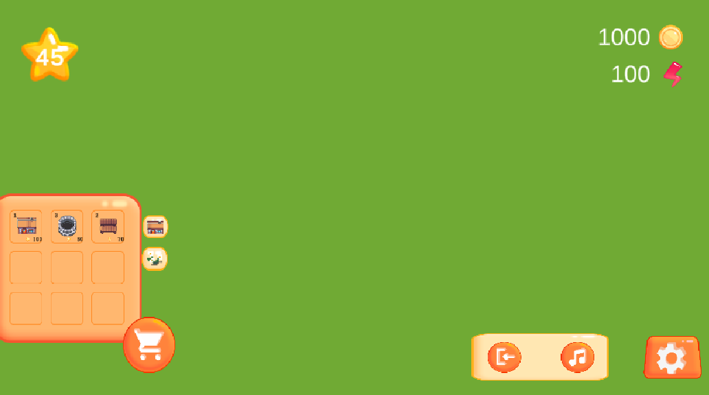
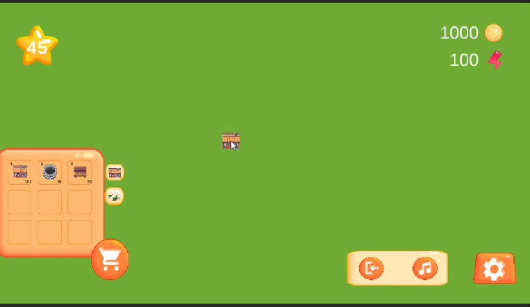

# FarmGame
## WibeSoft Case
## UI/UX Geliştirici Görevleri

PROJE AÇIKLAMASI

Bu proje, Unity ile geliştirilmiş bir 2D mobil çiftlik oyunu için temel UI/UX ve envanter sistemini içermektedir. Kullanıcı, oyun içi seviyesini, coin ve güç miktarını görüntüleyebilir ve envanter yönetimini gerçekleştirebilir. Ayrıca, sürükle-bırak özelliği ile item yerleşimi sağlanmaktadır.

KULLANILAN TEKNOLOJİLER
Unity 2022+

C# (Game development)

DOTween (UI animasyonları için)

TextMeshPro (Gelişmiş UI metin desteği)

Scriptable Objects (Öğe yönetimi için)

## Kullanılan Teknolojiler

Unity 2022+

C# (Game development)

DOTween (UI animasyonları için)

TextMeshPro (Gelişmiş UI metin desteği)

Scriptable Objects (Öğe yönetimi için)

## Özellikler

Dinamik UI Güncellemesi: Oyuncu bilgileri (seviye, coin, güç) anlık olarak ekrana yansıtılır.PlayerData ile güncellenmesi kolaylaştırılmıştır.

Envanter Sistemi: Sekmeli yapı ile farklı kategorilerde öğeler görüntülenebilir.InventoryManager ile sayfa ve öğe ekle-çıkar için modülerlik sağlamıştır.

Sürükle-Bırak Mekaniği: Oyuncu, itemleri ekrana sürükleyip bırakabilir.

Animasyonlu UI Açma/Kapatma: DOTween ile yumuşak geçişler sağlanmıştır

